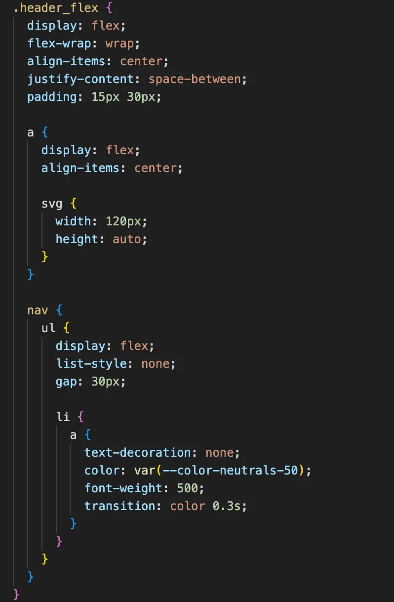
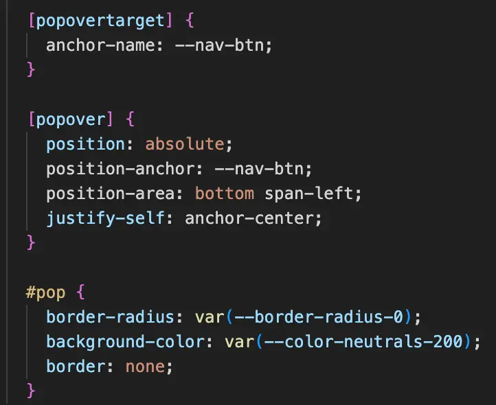
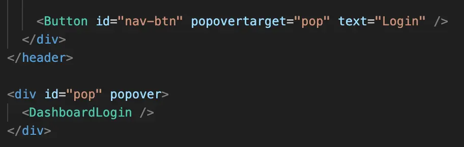
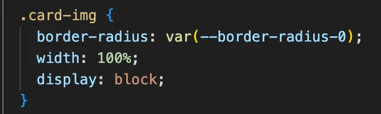
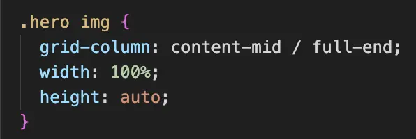
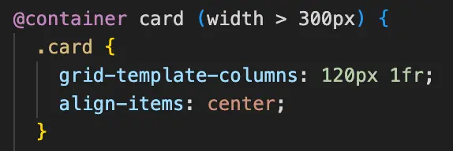
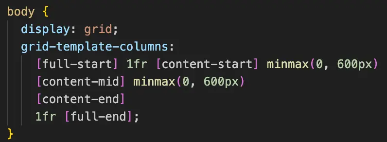

# Opgaverefleksion

I denne opgave skulle vi arbejde fra i frameworket Astro, som er et framework der bygger hjemmesider op ved brug af komponenter. Det smarte ved dette er at mange ting bliver genbrugt. Vi fik udleveret en Figma prototype, bestående af komponenter som header, footer, hero-sektion og en masse cards, som vi skulle kode. I undervisningen har vi gennemgået en masse nye måder at kode på i CSS. Det handlede blandt andet om cascade layers, text-styling, Nesting, animationer, interaktive elementer og meget andet. Alle disse nyintroducerede principper skulle dermed implementeres i vores kode og guide os igennem opgaven.  
Principper fra undervisningen fremgår I stort I set alt vores kode. Et eksempel kunne være Nesting. Nesting betyder at noget kode er placeret inde I noget andet, som f.eks vores header. Her er elementer som a-links nestet inde I .header_flex, for netop af få flex-styling og vertikal centrering, og inde I a-links ligger svg-ikonerne. I nav-menuen er strukturen yderligere nestet, hvor ul ligger inde i nav, li ligger inde i ul, og a ligger inde i li. Hvert niveau af disse nestinger sikrer netop, at styling kun påvirker de elementer, der er inde i den overordnede container. Dette er med til at skabe klarhed og gøre koden kortere og nemmere at læse.

Et andet princip vi også har implementeret fra undervisningen er et popover-element, som vises når der klikkes på login knappen i header. Til denne funktion bliver der brugt attributter som popover og popovertarget. Popover sættes på den sektion eller det element der skal vises når der sker en interaktion, her værende DasboardLogin. Popovertarget sættes på det element som popoveren er koblet til. Dette popovertarget-elemenet fungerer som referencepunkt, også kaldet anchor, for popoverens positionering.

Flere steder i vores kode har vi indtænkt det der kaldes for defensive CSS. Det er en måde at skrive CSS på, der sikrer at layoutet og designet af dit site ikke går i stykker, når indholdet eller skærmstørrelser ændres. Dette er blandt andet tænkt ind i vores Hero-sektion og på alle vores cards med img´er. Her er billederne nemlig kodet, så de hverken strækker eller bryder layoutet.

Et andet eksempel på defensive CSS ses i stylingen af komponentet EmployeeCards.astro. Her er komponentet stylet således at den kun reagerer på sin egen container og ikke på viewporten. Dette gør at designet holder, selv på små skærme.

Flere steder i vores kode gør også brug af både flex-bokse, overflow:hidden og repeat(). En betydelig defensiv CSS,som går igennem layoutet på alle vores sider, er grid på body.

Med denne funktion kan man placere indhold eller elementer i kolonner ved at skrive content-start / content-end, content-start / content-mid og content-mid / content-end. Ønskes det, at indholdet skal fylde hele siden, kan man skrive full (full-start / full-end) Fordi defensiv CSS netop handler om at forhindre layout-problemer, er denne funktion god, da den sørger for at elementer ikke kolliderer, da layoutet er delt op i ønskede kolonner og størrelser.
Fra vores undervisning, har vi lært om reduced-motion som er en kode der begrænser animationer for brugere der har behov for det. Vi forholdt os til funktionen, og undersøgte hvor vi ville implementere det da vi opdagede at koden allerede er inkorporeret i reset.css.

Vi brugte progressive enhancement i bl.a. vores team/index.astro og team/[slug].astro. Her blev først kortene og indholdet lagt ind, så vi visuelt kunne sikre os at alle oplysninger og links til den enkelte medarbejder fungerede. Derefter implementerede vi CSS og Grid for at style alt indhold. På den måde fungerer siden fundamentalt for alle brugere først, og styling er kun “enhancements”, som optimerer oplevelse uden at gå ned på funktionaliteten.
Vi har delt vores CSS op, så global.css styrer alt der skal være ens på hele sitet. F.eks. skrifttyper og grid-layout på body.

Vores komponent-specifikke styles ligger direkte i hver komponent. På den måde holder vi det isoleret, så ændringer i én komponent ikke påvirker resten af sitet.
Dog gentog vi flere css-regler, da vi ikke oprettede de forskellige elementer af tekst som komponenter. Det ville optimere vores kode, da det meste af tekstindhold går igen på hele sitet. Det vil vi forbedre til næste gang for at opnå en renere kode, der er nemmere at vedligeholde.

Opgaven har været både sjov og en god udfordring på det faglige plan. Det har været virkelig fedt, at vi i undervisningen lavede øvelser og mindre afleveringer, som skulle implementeres i opgaven. For os har udfordringerne blandt andet bestået i at skulle implementere nye principper og kode metoder på komponenter i Astro. Det har været svært, fordi frameworket er komponentbaseret og har flere style.css-filer, hvor styles nogle gange kan overskrive hinanden. Det har også været udfordrende at arbejde med den nye måde at opdele en sides layout på. Det var blandt andet fordi vi skulle sætte os ind i det nye layout-system og fordi det var svært at lave flere små layouts inde i det overordnede layout.
Derudover har det været ekstra udfordrende, fordi mange af komponenterne bestod enkelte cards, som blev mappet igennem, fordi der kom data fra en JSON-fil. Det gjorde komponenterne lidt mere komplicerede at style i starten, men når først man havde styr på det første komponent, blev det meget nemmere at style de næste. Til sidst brugte vi lang tid på at fejlfinde et komponent der gik galt da vi hostede sitet til Netlify. ourVision.astro kunne ikke overføres uden fejl, og vi har desværre ikke kunne løse problemet. En sidste "fejl" vi vil tage med os til næste gang, er at sikre os hosting til Netlify kører optimalt i god nok til at eventuelt få vejledning af undervisere/tutorer.
